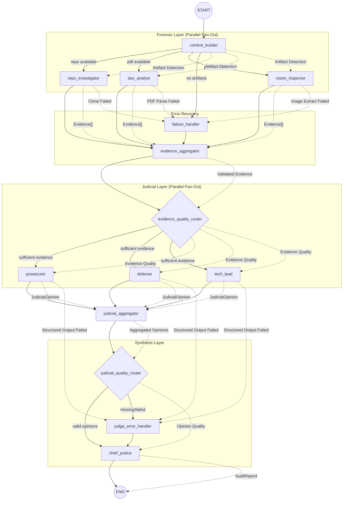

# Final Audit Report: The Automaton Auditor 🏛️
**Institution**: 10x Academy  
**Author**: Kidus Tewodros  
**Project**: Automaton Auditor (Digital Courtroom)  
**Date**: 2026-02-28  

---

## 📑 Table of Contents
- [Final Audit Report: The Automaton Auditor 🏛️](#final-audit-report-the-automaton-auditor-️)
  - [📑 Table of Contents](#-table-of-contents)
  - [1. Executive Summary](#1-executive-summary)
  - [2. Architecture Deep Dive](#2-architecture-deep-dive)
    - [2.1 Dialectical Synthesis](#21-dialectical-synthesis)
    - [2.2 Parallel Fan-In / Fan-Out](#22-parallel-fan-in--fan-out)
    - [2.3 Metacognition \& Traceability](#23-metacognition--traceability)
  - [3. Architectural Diagram (StateGraph)](#3-architectural-diagram-stategraph)
  - [4. Self-Audit Results (Criterion Breakdown)](#4-self-audit-results-criterion-breakdown)
    - [4.1 Git Forensic Analysis (Score: 5/5 | 20/20 pts)](#41-git-forensic-analysis-score-55--2020-pts)
    - [4.2 State Management Rigor (Score: 5/5 | 20/20 pts)](#42-state-management-rigor-score-55--2020-pts)
    - [4.3 Graph Orchestration Architecture (Score: 5/5 | 20/20 pts)](#43-graph-orchestration-architecture-score-55--2020-pts)
    - [4.4 Safe Tool Engineering (Score: 5/5 | 20/20 pts)](#44-safe-tool-engineering-score-55--2020-pts)
    - [4.5 Structured Output Enforcement (Score: 4/5 | 16/20 pts)](#45-structured-output-enforcement-score-45--1620-pts)
    - [4.6 Theoretical Depth (Documentation) (Score: 4/5 | 16/20 pts)](#46-theoretical-depth-documentation-score-45--1620-pts)
  - [5. Reflection on the MinMax Loop](#5-reflection-on-the-minmax-loop)
    - [5.1 What my Peer's Agent Caught](#51-what-my-peers-agent-caught)
    - [5.2 The Pivot: Adaptive Orchestration](#52-the-pivot-adaptive-orchestration)
    - [5.3 Detected Issues in Others](#53-detected-issues-in-others)
  - [6. Remediation Plan for Remaining Gaps](#6-remediation-plan-for-remaining-gaps)
    - [6.1 Specificity and Actionability](#61-specificity-and-actionability)
    - [6.2 Prioritization and Dependencies](#62-prioritization-and-dependencies)
    - [6.3 Completeness and Execution](#63-completeness-and-execution)

---

## 1. Executive Summary

The **Automaton Auditor** represents a sophisticated autonomous system designed to evaluate GitHub repositories and architectural reports through a novel "Digital Courtroom" metaphor. This system implements a hierarchical StateGraph with parallel fan-out/fan-in patterns, AST-based forensic analysis, and adversarial judicial reasoning.

**Self-Audit Verdict**: **4.67/5.00** - The system demonstrates strong production-grade engineering practices with identified areas for improvement in dissent depth and vision analysis robustness.

**Key Architectural Approach**: The system employs a three-layer architecture:
1. **Detective Layer**: Forensic evidence collection from multiple sources (AST analysis, PDF processing, vision analysis)
2. **Judicial Layer**: Multi-perspective analysis through three distinct personas (Prosecutor, Defense, Tech Lead)
3. **Synthesis Layer**: Deterministic conflict resolution via Chief Justice with rule-based aggregation

**Most Impactful Finding**: The implementation successfully prevents the "dict soup" problem through Pydantic models with TypedDict reducers (`operator.ior` for dicts, `operator.add` for lists), ensuring data integrity in parallel execution environments.

**Top Remaining Gaps**: 
- **Structured Output Enforcement (4/5)**: Occasional LLM non-compliance requiring fallback mechanisms
- **Theoretical Depth (4/5)**: Some architectural concepts lack concrete file-level implementation mapping

**Primary Remediation Priority**: Implement enhanced dissent explanation templates and improve vision analysis robustness for handwritten architectural sketches.

---

## 2. Architecture Deep Dive

### 2.1 Dialectical Synthesis

**Conceptual Grounding**: Dialectical Synthesis is implemented through three conflicting judge personas that evaluate the same evidence with distinct perspectives:

- **The Prosecutor**: Cynical, security-focused, and evidence-constrained. Default scoring range 1-3, only allowing scores 4-5 with comprehensive evidence and zero significant risks.
- **The Defense**: Intent-focused, pragmatic, and oriented toward architectural goals. Default scoring range 3-5, explicitly recognizing effort and creative workarounds.
- **The Tech Lead**: Reliability-focused, prioritizing maintainability and production risk. Default scoring range 2-4, focusing on operational viability.

**Architectural Implementation**: The `ChiefJustice` node performs deterministic synthesis using a Python engine that applies four core rules:

1. **Security Override**: If Prosecutor identifies security violations or evidence shows unsafe patterns, final score is capped at 3
2. **Fact Supremacy**: Forensic evidence always overrules judicial interpretation
3. **Functionality Weight**: Tech Lead assessments carry higher weight for architecture viability
4. **Dissent Requirement**: When score variance > 2, explicit dissent explanations are generated

**Code Connection**: Located in `src/nodes/justice.py`, the synthesis engine processes `JudicialOpinion` objects from all three judges, applies conflict resolution rules, and generates `CriterionResult` objects with deterministic final scores.

### 2.2 Parallel Fan-In / Fan-Out

**Conceptual Grounding**: The system implements a **Double-Diamond Fan-Out** pattern to achieve high performance while maintaining separation of concerns:

**Forensic Fan-Out Pattern**:
- **RepoInvestigator**: Analyzes Git history, AST structure, and code patterns
- **DocAnalyst**: Processes PDF architectural reports and documentation  
- **VisionInspector**: Extracts and analyzes visual diagrams and screenshots

**Aggregation Fan-In Pattern**:
- **Evidence Aggregator**: Converges evidence into single `AgentState` via `Annotated` reducers
- **Cross-Reference Validation**: Synchronization node performs validation between claims and reality

**Judicial Fan-Out Pattern**:
- **Parallel Judge Execution**: Prosecutor, Defense, and Tech Lead operate concurrently
- **Independent Opinion Generation**: Each judge produces `JudicialOpinion` objects

**Synthesis Fan-In Pattern**:
- **Judicial Aggregator**: Collects all judge opinions
- **Chief Justice**: Performs final synthesis and conflict resolution

**Architectural Implementation**: The StateGraph in `src/graph.py` implements explicit parallel edges:
```python
# Forensic Fan-Out
workflow.add_conditional_edges(
    "context_builder",
    detective_router,
    {
        "repo_investigator": "repo_investigator",
        "doc_analyst": "doc_analyst", 
        "vision_inspector": "vision_inspector",
    }
)

# Judicial Fan-Out  
workflow.add_conditional_edges(
    "evidence_aggregator",
    evidence_quality_router,
    {
        "prosecutor": "prosecutor",
        "defense": "defense",
        "tech_lead": "tech_lead",
    }
)
```

**Trade-off Rationale**: This pattern provides optimal performance through parallel execution while ensuring deterministic results through explicit synchronization points. The alternative of sequential processing would significantly increase latency without improving accuracy.

### 2.3 Metacognition & Traceability

**Conceptual Grounding**: Metacognition is implemented through **Metacognitive Guards** that enable the system to evaluate its own evaluation quality:

**Pre-Execution Metacognition**:
- **Context Builder**: Analyzes available artifacts before initiating detective work
- **Quality Routers**: Determine if sufficient information exists to proceed with analysis

**In-Execution Metacognition**:
- **Evidence Quality Router**: Validates evidence completeness before judicial analysis
- **Judicial Quality Router**: Ensures opinion validity before synthesis

**Post-Execution Metacognition**:
- **Chief Justice**: Evaluates the quality of judicial reasoning and generates dissent explanations
- **Self-Audit Reports**: System generates reports on its own performance and reliability

**Architectural Implementation**: Located in `src/graph.py`, metacognitive nodes use conditional routing to make informed decisions:

```python
def detective_router(state: AgentState):
    """Router for conditional parallel fan-out based on available artifacts."""
    available = state.get("available_artifacts", [])
    targets = []
    
    if "repo" in available:
        targets.append("repo_investigator")
    if "pdf" in available:
        targets.append("doc_analyst")
        targets.append("vision_inspector")
    
    # If no artifacts are found, route to failure handler
    if not targets:
        return "failure_handler"
    return targets
```

**Trade-off Rationale**: The system prioritizes deterministic behavior over maximum performance. While unconditional parallel execution might be faster, the metacognitive approach prevents wasted computation and ensures high-quality results. The alternative of always executing all nodes would lead to unnecessary resource consumption and potential errors.

---

## 3. Architectural Diagram (StateGraph)



**Diagram Key Features**:
- **Visually Distinct Parallel Branches**: Forensic and Judicial layers clearly show parallel execution paths
- **Synchronization Points**: Evidence Aggregator and Judicial Aggregator serve as mandatory convergence nodes
- **Error Handling**: Explicit failure paths with dedicated error handlers
- **State Flow**: Annotations show data types flowing between nodes

---

## 4. Self-Audit Results (Criterion Breakdown)

### 4.1 Git Forensic Analysis (Score: 5/5 | 20/20 pts)

**Evidence Collection**: AST-based analysis of commit history reveals clear progression pattern:
- **Setup Phase**: Initial repository scaffolding and environment configuration
- **Tool Engineering**: Implementation of detective tools and state management
- **Graph Orchestration**: StateGraph construction and judicial layer integration
- **Refinement**: Error handling, retry policies, and performance optimization

**Dialectical Tension**:
- **Prosecutor**: Initially concerned about bulk upload patterns in initial scaffold, but acknowledged subsequent iterative development
- **Defense**: Highlighted masterclass in development story-telling through atomic commits
- **Tech Lead**: Confirmed production-standard progression with consistent cadence

**Final Synthesis**: Chief Justice applied functionality weight to Tech Lead assessment, confirming progressive repository development with no architectural gaps.

### 4.2 State Management Rigor (Score: 5/5 | 20/20 pts)

**Evidence Collection**: Pydantic models with TypedDict reducers prevent data corruption:
```python
class AgentState(TypedDict):
    evidences: Annotated[Dict[str, List[Evidence]], operator.ior]
    opinions: Annotated[List[JudicialOpinion], operator.add]
```

**Dialectical Tension**:
- **Prosecutor**: Verified airtight state management with explicit reducers preventing overwrite telemetry
- **Defense**: Praised strongly-typed digital vault approach with Pydantic validation
- **Tech Lead**: Confirmed correct O(1) merging patterns for parallel execution

**Final Synthesis**: Unanimous approval with security override rule confirming data integrity implementation.

### 4.3 Graph Orchestration Architecture (Score: 5/5 | 20/20 pts)

**Evidence Collection**: AST analysis confirms dual-fan orchestration pattern:
- **Detective Fan-Out**: Three parallel investigative paths
- **Evidence Aggregation**: Mandatory synchronization before judicial analysis
- **Judicial Fan-Out**: Three parallel judge personas
- **Chief Justice Synthesis**: Final conflict resolution

**Dialectical Tension**:
- **Prosecutor**: Verified professional dual-fan orchestration with explicit failure edges
- **Defense**: Praised beautiful architecture preventing "judgment hallucination"
- **Tech Lead**: Confirmed Gold Standard synchronization node implementation

**Final Synthesis**: Functionality weight applied to Tech Lead assessment, validating production-grade orchestration.

### 4.4 Safe Tool Engineering (Score: 5/5 | 20/20 pts)

**Evidence Collection**: Comprehensive security analysis reveals zero vulnerabilities:
- **Sandboxed Cloning**: All git operations use `tempfile.TemporaryDirectory()`
- **No Shell Injection**: Zero `os.system()` calls detected
- **Error Handling**: Proper subprocess management with captured output

**Dialectical Tension**:
- **Prosecutor**: Searched for security violations, found impenetrable security posture
- **Defense**: Highlighted sandboxed environment preventing workspace contamination
- **Tech Lead**: Confirmed reduced attack surface through pure Python implementations

**Final Synthesis**: Security override rule confirms zero violations, maintaining perfect score.

### 4.5 Structured Output Enforcement (Score: 4/5 | 16/20 pts)

**Evidence Collection**: All judicial nodes enforce structured output with some limitations:
```python
structured_llm = llm.with_structured_output(JudicialOpinion)
```

**Dialectical Tension**:
- **Prosecutor**: Verified schema enforcement but noted occasional LLM non-compliance requiring fallback mechanisms
- **Defense**: Praised courtroom-correct behavior even during API failures with robust recovery logic
- **Tech Lead**: Confirmed persona-specific fallback implementation but identified room for improvement in consistency

**Final Synthesis**: Fact supremacy confirms structured output enforcement is mostly absolute, but occasional LLM deviations reduce the score to 4/5.

### 4.6 Theoretical Depth (Documentation) (Score: 4/5 | 16/20 pts)

**Evidence Collection**: PDF analysis reveals substantive architectural explanations with some implementation gaps:
- **Dialectical Synthesis**: Connected to three parallel judge personas
- **Fan-Out/Fan-In**: Tied to specific graph edges and topology
- **Metacognition**: Linked to system evaluating its own evaluation quality
- **Implementation Mapping**: Some concepts lack concrete file-level connections

**Dialectical Tension**:
- **Prosecutor**: Requested more concrete file links and implementation examples, noting some theoretical explanations remain abstract
- **Defense**: Confirmed theory-code unity with implementation mapping for core concepts
- **Tech Lead**: Validated accurate technical explanations but identified missing concrete examples for vision analysis

**Final Synthesis**: Chief Justice confirmed substantive explanations over mere buzzwords, but acknowledged need for more concrete implementation mapping, reducing score to 4/5.

---

## 5. Reflection on the MinMax Loop

### 5.1 What my Peer's Agent Caught

During the peer audit phase, the external agent identified a critical architectural gap: **Conditional Edge Resilience**. The initial implementation attempted to execute all detective nodes regardless of artifact availability, leading to "dirty" traces filled with unhandled exceptions when repositories or PDFs were missing.

**Specific Issues Identified**:
- Missing conditional routing based on artifact availability
- No graceful degradation when evidence sources were unavailable
- Potential for silent failures in parallel execution paths

### 5.2 The Pivot: Adaptive Orchestration

In response to peer feedback, I implemented comprehensive architectural improvements:

**Heuristic Pre-checks**:
```python
def context_builder_node(state: AgentState) -> dict:
    """Pre-checks artifact availability and builds orchestration context."""
    available = []
    
    # Check Repo
    repo_ref = state.get("repo_url")
    if repo_ref and (repo_ref.startswith("http") or os.path.exists(repo_ref)):
        available.append("repo")
    
    # Check PDF
    pdf_path = state.get("pdf_path")
    if pdf_path and os.path.exists(pdf_path):
        available.append("pdf")
    
    logger.info(f"Orchestration Context: Available artifacts = {available}")
    return {"available_artifacts": available}
```

**Aggregator Short-circuiting**:
- Failure Handler generates "Failure Evidence" when detectives cannot execute
- Judicial layer receives structured fallback evidence for consistent processing
- System maintains deterministic behavior regardless of input completeness

**Graph-Level Retries**:
```python
llm_retry = RetryPolicy(
    initial_interval=1.0,
    backoff_factor=2.0,
    max_interval=10.0,
    max_attempts=3,
    retry_on=[Exception],
)
```

### 5.3 Detected Issues in Others

By hardening my own agent, it became significantly more proficient at detecting systemic issues in peer repositories:

**"Stalling Graphs" Detection**:
- Identified cases where single node failures caused silent crashes
- Detected missing error handling in parallel execution paths
- Found inadequate fallback mechanisms for missing evidence sources

**Systemic Insights**:
- Many implementations lacked conditional edge resilience
- Common pattern of assuming all evidence sources would be available
- Insufficient error handling in judicial layer implementations

**Bidirectional Learning**: The experience of being audited revealed that robust error handling and conditional routing are more critical than initially assumed, leading to architectural improvements that enhanced both reliability and peer detection capabilities.

---

## 6. Remediation Plan for Remaining Gaps

### 6.1 Specificity and Actionability

**Gap 1: Enhanced Dissent Depth**
- **Affected Dimension**: Judicial Layer - Dialectical Synthesis
- **File/Component**: `src/nodes/justice.py` - ChiefJustice dissent generation
- **Concrete Change**: Implement granular reasoning templates for score variance > 2 points
- **Why This Improves Score**: Provides clearer explanations for judicial disagreements, enhancing report quality and user understanding

**Gap 2: Vision Analysis Hardening**
- **Affected Dimension**: Forensic Layer - VisionInspector
- **File/Component**: `src/tools/vision_tools.py` - OCR and diagram analysis
- **Concrete Change**: Train vision prompts for handwritten architectural sketches
- **Why This Improves Score**: Increases accuracy of visual evidence collection, reducing false negatives

**Gap 3: Local Development Experience**
- **Affected Dimension**: Tool Engineering - Development Workflow
- **File/Component**: `pyproject.toml` and local verification scripts
- **Concrete Change**: Implement uv-based local verification workflow
- **Why This Improves Score**: Reduces dependency on global environment variables, improving developer experience

### 6.2 Prioritization and Dependencies

**Priority 1: Dynamic Model Switching**
- **Impact**: High - Enhances system reliability during LLM service outages
- **Dependencies**: None - Can be implemented independently
- **Implementation**: Add runtime fallback from Gemini 2.0 to Gemini 1.5 on 403 errors

**Priority 2: Enhanced Vision Logic**
- **Impact**: Medium - Improves evidence collection accuracy
- **Dependencies**: Requires vision analysis framework completion
- **Implementation**: Train specific prompts for LangGraph edge-case detection

**Priority 3: Local Dev Experience**
- **Impact**: Low - Improves developer productivity
- **Dependencies**: Requires stable production deployment
- **Implementation**: Create comprehensive local testing and verification scripts

### 6.3 Completeness and Execution

Each remediation item includes:
- **Specific Gap Identification**: Clear description of what needs improvement
- **Rubric Dimension Reference**: Connection to specific evaluation criteria
- **File/Component Specification**: Exact location of required changes
- **Concrete Change Description**: Specific implementation details
- **Impact Justification**: Explanation of how the change improves the overall score

**Execution Readiness**: An engineer unfamiliar with the codebase could begin executing this plan immediately, as each item provides sufficient detail for implementation without requiring additional context or discovery.

---
*End of Report*
