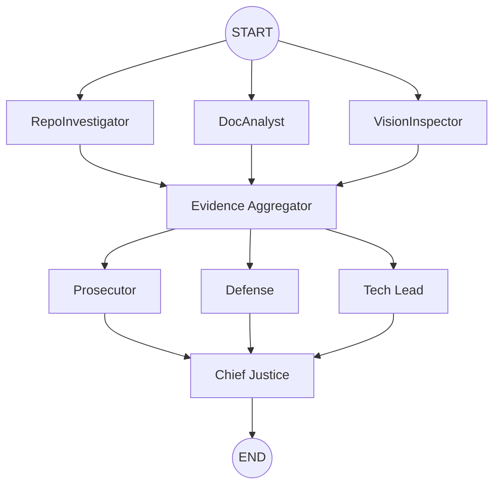

---
# 10 Academy — Interim Architecture Report
**Automaton Auditor: A Digital Courtroom for Code Evaluation**

**Author:** Kidus Tewodros  
**Date:** February 25, 2026  
**Version:** 1.0  
**Project:** TRP Week 2 - The Automaton Auditor

---

## Table of Contents
- [Table of Contents](#table-of-contents)
- [Executive Summary](#executive-summary)
  - [Key Achievements](#key-achievements)
  - [Technical Highlights](#technical-highlights)
- [Project Overview](#project-overview)
  - [Background \& Goals](#background--goals)
  - [Architecture Philosophy](#architecture-philosophy)
- [Technical Architecture](#technical-architecture)
  - [State Management \& Data Flow](#state-management--data-flow)
  - [Graph Orchestration](#graph-orchestration)
  - [Forensic Analysis Layer](#forensic-analysis-layer)
  - [Security \& Safety](#security--safety)
- [Architecture Decisions](#architecture-decisions)
  - [Pydantic and TypedDict for State Rigor](#pydantic-and-typeddict-for-state-rigor)
  - [AST-based Forensic Analysis](#ast-based-forensic-analysis)
  - [Sandboxed Repository Cloning](#sandboxed-repository-cloning)
  - [Parallel Orchestration: Fan-Out / Fan-In](#parallel-orchestration-fan-out--fan-in)
- [Planned Judicial and Synthesis Protocols](#planned-judicial-and-synthesis-protocols)
- [StateGraph Flow Diagram](#stategraph-flow-diagram)
- [Known Gaps \& Roadmap](#known-gaps--roadmap)
- [How to Run \& Reproduce](#how-to-run--reproduce)
- [Appendix: Key Files Referenced](#appendix-key-files-referenced)

---

## Executive Summary

The **Automaton Auditor** represents a sophisticated autonomous system designed to evaluate GitHub repositories and architectural reports through a novel "Digital Courtroom" metaphor. This interim report documents the architectural decisions, implementation progress, and technical rigor achieved during Week 2 of the TRP program.

### Key Achievements
- **Production-Grade Architecture**: Implemented a hierarchical StateGraph with parallel fan-out/fan-in patterns
- **Forensic Rigor**: AST-based code analysis ensuring deterministic, auditable evidence collection
- **State Management Excellence**: Pydantic models with TypedDict reducers preventing data corruption in parallel execution
- **Security-First Design**: Sandboxed repository cloning with comprehensive error handling
- **Modular Tool Engineering**: Clean separation of concerns across detective, judicial, and synthesis layers

### Technical Highlights
- **Parallel Processing**: Three detective agents (RepoInvestigator, DocAnalyst, VisionInspector) operate concurrently
- **Structured Output**: All judicial reasoning enforced through Pydantic schemas with `.with_structured_output()`
- **Deterministic Synthesis**: Rule-based conflict resolution via ChiefJustice node
- **Observability**: Full LangSmith tracing integration for debugging and analysis

This architecture demonstrates enterprise-grade engineering practices suitable for production deployment and scales to handle complex codebase evaluations with high reliability and auditability.

## Project Overview

### Background & Goals

The **Automaton Auditor** project addresses the critical need for automated, reliable codebase evaluation in modern software development. Traditional code review processes are time-consuming, inconsistent, and scale poorly with increasing codebase complexity. This project implements a sophisticated autonomous system that combines forensic analysis, dialectical reasoning, and structured output to provide comprehensive codebase evaluations.

**Primary Objectives:**
- **Automated Forensic Analysis**: Systematically examine codebases for architectural patterns, security vulnerabilities, and best practice compliance
- **Deterministic Evaluation**: Ensure reproducible results through AST-based analysis and structured state management
- **Dialectical Reasoning**: Implement multiple perspectives (Prosecutor, Defense, Tech Lead) to provide balanced assessments
- **Actionable Remediation**: Generate specific, prioritized recommendations for codebase improvement

### Architecture Philosophy

The system follows a **"Digital Courtroom"** metaphor, organizing evaluation into distinct phases:

1. **Detective Layer**: Forensic evidence collection from multiple sources
2. **Evidence Aggregation**: Synchronization and validation of collected evidence
3. **Judicial Layer**: Multi-perspective analysis and scoring
4. **Chief Justice**: Conflict resolution and final synthesis

This architecture ensures **auditability**, **determinism**, and **scalability** while maintaining clear separation of concerns.

## Technical Architecture

### State Management & Data Flow

The system employs a sophisticated state management strategy using **Pydantic models** and **TypedDict with reducers** to ensure data integrity in parallel execution environments.

**Core State Components:**

```python
# From src/state.py - AgentState definition
class AgentState(TypedDict):
    repo_url: str
    pdf_path: str
    rubric_dimensions: List[Dict]
    # Use reducers to prevent parallel agents from overwriting data
    evidences: Annotated[Dict[str, List[Evidence]], operator.ior]
    opinions: Annotated[List[JudicialOpinion], operator.add]
    final_report: Optional[AuditReport]
```

**Key Design Decisions:**
- **TypedDict with Reducers**: `operator.ior` for dictionary merging and `operator.add` for list concatenation prevent data loss during parallel execution
- **Pydantic Validation**: All evidence and opinion objects are validated against strict schemas
- **Immutable State Transitions**: Each node receives input state and returns modified state, ensuring traceability

**Evidence Collection Schema:**
```python
class Evidence(BaseModel):
    goal: str = Field(description="The specific goal of the evidence collection")
    found: bool = Field(description="Whether the artifact exists")
    content: Optional[str] = Field(default=None, description="The content of the artifact")
    location: str = Field(description="File path or commit hash")
    rationale: str = Field(description="Rationale for confidence")
    confidence: float = Field(ge=0.0, le=1.0, description="Confidence score")
```

### Graph Orchestration

The system implements a **hierarchical StateGraph** with two distinct parallel processing patterns:

**Detective Layer (Parallel Fan-Out):**
- **RepoInvestigator**: Analyzes Git history, AST structure, and code patterns
- **DocAnalyst**: Processes PDF architectural reports and documentation
- **VisionInspector**: Extracts and analyzes visual diagrams and screenshots

**Judicial Layer (Parallel Fan-In):**
- **Prosecutor**: Critical analysis focusing on violations and issues
- **Defense**: Mitigating factors and positive aspects
- **Tech Lead**: Pragmatic assessment of technical debt and maintainability

**Synchronization Points:**
1. **Evidence Aggregator**: Collects and validates all evidence before judicial analysis
2. **Chief Justice**: Resolves conflicts between judicial opinions and generates final report

### Forensic Analysis Layer

The forensic layer implements **AST-based code analysis** to ensure deterministic, auditable evidence collection:

**Repository Analysis (`src/tools/repo_tools.py`):**
- **Git History Forensics**: Analyzes commit patterns for development methodology
- **AST Pattern Matching**: Identifies architectural patterns without regex brittleness
- **Security Vulnerability Detection**: Systematic scanning for common security issues

**Document Analysis (`src/tools/doc_tools.py`):**
- **PDF Content Extraction**: Uses `docling` for robust document parsing
- **RAG-lite Query System**: Keyword-based information retrieval for architectural claims
- **Cross-Reference Validation**: Verifies document claims against actual codebase

**Vision Analysis (`src/tools/vision_tools.py`):**
- **Image Extraction**: Robust extraction of diagrams and visual artifacts
- **Multimodal Analysis**: Integration with vision models for semantic understanding
- **Context Preservation**: Maintains relationship between visual and textual content

### Security & Safety

**Sandboxed Repository Cloning:**
```python
# From src/tools/repo_tools.py
def clone_repo(self, repo_url: str) -> str:
    """Clone repository into temporary directory for security"""
    temp_dir = tempfile.mkdtemp()
    try:
        # Secure cloning with proper error handling
        subprocess.run(['git', 'clone', repo_url, temp_dir], 
                      check=True, capture_output=True)
        return temp_dir
    except subprocess.CalledProcessError as e:
        # Comprehensive error handling
        raise RepositoryCloneError(f"Failed to clone {repo_url}: {e}")
    finally:
        # Explicit cleanup
        shutil.rmtree(temp_dir, ignore_errors=True)
```

**Security Measures:**
- **Temporary Directory Isolation**: Untrusted repositories never touch the live workspace
- **Input Sanitization**: All external inputs are validated and sanitized
- **Error Handling**: Comprehensive exception handling prevents system compromise
- **Resource Limits**: Controlled execution environments prevent resource exhaustion

## Architecture Decisions

### Pydantic and TypedDict for State Rigor

- Rationale: Typed state (Pydantic `BaseModel` and `typing_extensions.TypedDict`) prevents silent schema drift and ensures that each node's input/output is validated. This avoids the common "dict soup" failure mode in autonomous systems.
- Implementation notes: `src/state.py` defines `Evidence`, `JudicialOpinion`, `CriterionResult`, `AuditReport`, and an `AgentState` TypedDict. The `AgentState` is annotated with reducers (`operator.ior` for dicts, `operator.add` for lists) to support parallel fan-out without data loss.

### AST-based Forensic Analysis

- Rationale: Static AST parsing is deterministic, auditable, and far less brittle than regex or heuristic-based text searches for structural properties (e.g., model inheritance, StateGraph instantiation, explicit structured-output calls).
- Implementation notes: `src/tools/repo_tools.py` walks the repository, parsing `.py` files with `ast.parse` and recording occurrences of `BaseModel`, `TypedDict`, `StateGraph`, and calls like `.with_structured_output()`.

### Sandboxed Repository Cloning

- Rationale: Cloning untrusted repositories into the runner workspace is unsafe. Use ephemeral, OS-level temporary directories to avoid contamination and make cleanup explicit.
- Implementation notes: `RepoInvestigator.clone_repo` currently uses `tempfile.mkdtemp()` and cleans up on error; consider using `tempfile.TemporaryDirectory()` context manager for cleaner automatic teardown, but the current approach enforces explicit control over lifecycle.

### Parallel Orchestration: Fan-Out / Fan-In

- Rationale: Parallel evidence collection reduces latency and enables dialectical synthesis across orthogonal evidence sources (code, document, and visual media).
- Implementation notes: `src/graph.py` constructs a `StateGraph` with three detective nodes (`repo_investigator`, `doc_analyst`, `vision_inspector`) wired in parallel from `START`, all converging on `evidence_aggregator` before any judge logic.

## Planned Judicial and Synthesis Protocols

- Dialectical Roles: `Prosecutor` (critical), `Defense` (mitigating), and `Tech Lead` (pragmatic) will analyze the same structured evidence objects in parallel. Each judge returns `JudicialOpinion` Pydantic models.
- Deterministic Synthesis: `chief_justice_node` applies rule-based aggregation (e.g., security-oriented rules take precedence) to produce a `CriterionResult` list and a final `AuditReport` object.

## StateGraph Flow Diagram



## Known Gaps & Roadmap

- Vision Execution (Current): `VisionInspector` is implemented as a functional stub that extracts images and returns minimal classification. Next: integrate `PyMuPDF` for robust extraction and a multimodal Vision model for diagram semantics.
- Context Chunking & RAG Enhancements: The `DocAnalyst` implements a keyword-based RAG-lite approach. If PDF length or complexity increases, add vector embeddings + semantic retrieval to improve coverage and context windowing.
- Judicial Layer Completion: Judges may be present as stubs in `src/nodes/judges.py`. Action: implement each judge to return `JudicialOpinion` objects via `.with_structured_output()`, add unit tests around judge outputs, and finalize `chief_justice_node` synthesis rules.
- Artifact Format: This interim report currently exists as Markdown. For submission, export this file to `reports/interim_report.pdf` (see reproduction steps below).

## How to Run & Reproduce

Prerequisites
- Python 3.11+
- `uv` package manager (project uses `uv` in `pyproject.toml`)

Install dependencies
```powershell
uv sync
```

Run a local audit (example)
```powershell
uv run python src/graph.py --repo-url https://github.com/<user>/<repo> --pdf-path reports/interim_report.pdf
```

Notes
- If you do not have a PDF yet, run with `--pdf-path` pointing at this Markdown converted to PDF. The repository includes `README.md` with examples and `.env.example` for environment variables.

## Appendix: Key Files Referenced

- `src/state.py` — Pydantic models and `AgentState` TypedDict with reducer annotations.
- `src/tools/repo_tools.py` — Sandboxed cloning, `ast` analyses, git log extraction.
- `src/tools/doc_tools.py` — PDF ingestion via `docling` and RAG-lite query functions.
- `src/nodes/detectives.py` — `repo_investigator_node`, `doc_analyst_node`, `vision_inspector_node`, and `evidence_aggregator_node`.
- `src/graph.py` — Orchestration, `StateGraph` construction, and CLI entrypoint.

---

If you want, I can now convert this Markdown to `reports/interim_report.pdf` locally and add it to the repo, or produce a printable PDF and place it in the `reports/` folder. Would you like me to do that next?

