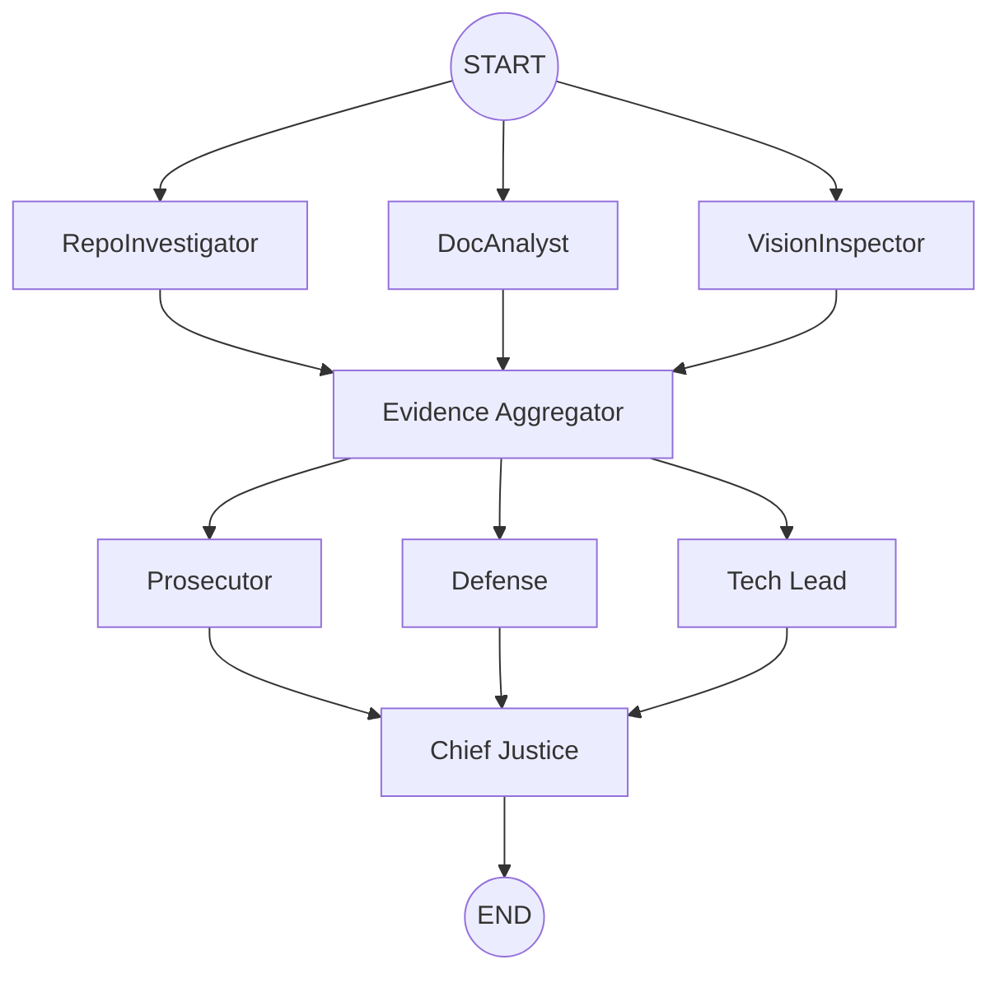

# Interim Architecture Report: The Automaton Auditor

## Architecture Decisions

### 1. Pydantic over Dicts
We chose Pydantic `BaseModel` and `TypedDict` for state management to ensure strict governance. In an autonomous system, "Dict Soups" lead to architectural brittleness. Pydantic enforces the schema at every node transition, preventing hallucinated or malformed data from propagating through the swarm.

### 2. AST-based Forensic Analysis
Instead of brittle Regex, we implemented the `RepoInvestigator` using Python's `ast` module. This allows the system to verify the actual structural integrity of the code (e.g., verifying `StateGraph` instantiation and `BaseModel` inheritance) with deterministic precision.

### 3. Sandboxed Repository Cloning
Security is a primary concern. The `RepoInvestigator` uses `tempfile.TemporaryDirectory()` to ensure that untrusted code is cloned into isolated environments, preventing cross-contamination with the orchestrator's workspace.

### 4. Parallel Orchestration (Fan-Out/Fan-In)
The graph is engineered for maximum efficiency and dialectical reasoning:
- **Detective Fan-Out:** `RepoInvestigator`, `DocAnalyst`, and `VisionInspector` run concurrently to collect evidence from different source types.
- **Evidence Aggregation (Fan-In):** A synchronization node ensures all forensic facts are collected before the deliberation phase begins.
- **Judicial Fan-Out:** The Prosecutor, Defense, and Tech Lead analyze the same evidence in parallel from their distinct philosophical lenses.

## Planned Judicial and Synthesis Protocols

- **Dialectical Reasoning:** Forced disagreement between the Prosecutor (critical) and Defense (optimistic), with the Tech Lead as the pragmatic mediator.
- **Deterministic Synthesis:** The `ChiefJusticeNode` resolves conflicts using a hardcoded hierarchy (e.g., Security Rules always override effort-based points).

## StateGraph Flow Diagram

## Known Gaps and Concrete Plan
- **Vision Execution:** Currently, the `VisionInspector` is implemented as a stub. The plan is to integrate `PyMuPDF` for image extraction and Gemini Pro Vision for multimodal analysis.
- **Context Chunking:** The RAG-lite approach for PDF ingestion will be expanded with vector embeddings if report size exceeds standard context windows.
