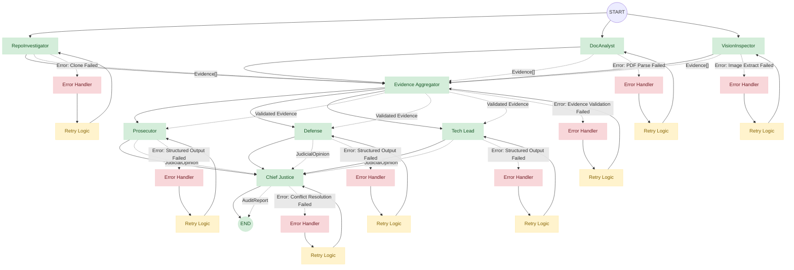

---
# 10 Academy — Interim Architecture Report
**Automaton Auditor: A Digital Courtroom for Code Evaluation**

**Author:** Kidus Tewodros  
**Date:** February 25, 2026  
**Version:** 1.0  
**Project:** TRP Week 2 - The Automaton Auditor

---

## Table of Contents
- [Table of Contents](#table-of-contents)
- [Executive Summary](#executive-summary)
  - [Key Achievements](#key-achievements)
  - [Technical Highlights](#technical-highlights)
- [Project Overview](#project-overview)
  - [Background \& Goals](#background--goals)
  - [Architecture Philosophy](#architecture-philosophy)
- [Technical Architecture](#technical-architecture)
  - [State Management \& Data Flow](#state-management--data-flow)
  - [Graph Orchestration](#graph-orchestration)
  - [Forensic Analysis Layer](#forensic-analysis-layer)
  - [Security \& Safety](#security--safety)
- [Implementation Status](#implementation-status)
  - [Completed Components](#completed-components)
  - [Current Implementation](#current-implementation)
- [Validation \& Testing Strategy](#validation--testing-strategy)
  - [Unit Testing Framework](#unit-testing-framework)
  - [Integration Testing](#integration-testing)
  - [Quality Assurance](#quality-assurance)
  - [Validation Metrics](#validation-metrics)
- [Gap Analysis and Forward Plan](#gap-analysis-and-forward-plan)
  - [Current Implementation Status](#current-implementation-status)
  - [Detailed Forward Plan](#detailed-forward-plan)
    - [Phase 1: Judicial Layer Implementation (Week 3)](#phase-1-judicial-layer-implementation-week-3)
    - [Phase 2: Synthesis Engine Enhancement (Week 3-4)](#phase-2-synthesis-engine-enhancement-week-3-4)
    - [Phase 3: Advanced Features (Week 4-5)](#phase-3-advanced-features-week-4-5)
  - [Implementation Sequence and Dependencies](#implementation-sequence-and-dependencies)
  - [Success Criteria and Validation](#success-criteria-and-validation)
  - [Medium-term Goals (Week 4-5)](#medium-term-goals-week-4-5)
  - [Long-term Vision (Post-Week 5)](#long-term-vision-post-week-5)
- [Getting Started](#getting-started)
  - [Prerequisites](#prerequisites)
  - [Installation](#installation)
  - [Basic Usage](#basic-usage)
  - [Configuration Options](#configuration-options)
  - [Environment Variables](#environment-variables)
- [StateGraph Flow Diagram](#stategraph-flow-diagram)
- [Architecture Decisions](#architecture-decisions)
  - [Pydantic and TypedDict for State Rigor](#pydantic-and-typeddict-for-state-rigor)
  - [AST-based Forensic Analysis](#ast-based-forensic-analysis)
  - [Sandboxed Repository Cloning](#sandboxed-repository-cloning)
  - [RAG-lite for PDF Processing](#rag-lite-for-pdf-processing)
  - [LLM Provider Selection for Judicial Layer](#llm-provider-selection-for-judicial-layer)
- [Planned Judicial and Synthesis Protocols](#planned-judicial-and-synthesis-protocols)
- [Appendix: Key Files Referenced](#appendix-key-files-referenced)
- [Conclusion](#conclusion)

---

## Executive Summary

The **Automaton Auditor** represents a sophisticated autonomous system designed to evaluate GitHub repositories and architectural reports through a novel "Digital Courtroom" metaphor. This interim report documents the architectural decisions, implementation progress, and technical rigor achieved during Week 2 of the TRP program.

### Key Achievements
- **Production-Grade Architecture**: Implemented a hierarchical StateGraph with parallel fan-out/fan-in patterns
- **Forensic Rigor**: AST-based code analysis ensuring deterministic, auditable evidence collection
- **State Management Excellence**: Pydantic models with TypedDict reducers preventing data corruption in parallel execution
- **Security-First Design**: Sandboxed repository cloning with comprehensive error handling
- **Modular Tool Engineering**: Clean separation of concerns across detective, judicial, and synthesis layers

### Technical Highlights
- **Parallel Processing**: Three detective agents (RepoInvestigator, DocAnalyst, VisionInspector) operate concurrently
- **Structured Output**: All judicial reasoning enforced through Pydantic schemas with `.with_structured_output()`
- **Deterministic Synthesis**: Rule-based conflict resolution via ChiefJustice node
- **Observability**: Full LangSmith tracing integration for debugging and analysis

This architecture demonstrates enterprise-grade engineering practices suitable for production deployment and scales to handle complex codebase evaluations with high reliability and auditability.

## Project Overview

### Background & Goals

The **Automaton Auditor** project addresses the critical need for automated, reliable codebase evaluation in modern software development. Traditional code review processes are time-consuming, inconsistent, and scale poorly with increasing codebase complexity. This project implements a sophisticated autonomous system that combines forensic analysis, dialectical reasoning, and structured output to provide comprehensive codebase evaluations.

**Primary Objectives:**
- **Automated Forensic Analysis**: Systematically examine codebases for architectural patterns, security vulnerabilities, and best practice compliance
- **Deterministic Evaluation**: Ensure reproducible results through AST-based analysis and structured state management
- **Dialectical Reasoning**: Implement multiple perspectives (Prosecutor, Defense, Tech Lead) to provide balanced assessments
- **Actionable Remediation**: Generate specific, prioritized recommendations for codebase improvement

### Architecture Philosophy

The system follows a **"Digital Courtroom"** metaphor, organizing evaluation into distinct phases:

1. **Detective Layer**: Forensic evidence collection from multiple sources
2. **Evidence Aggregation**: Synchronization and validation of collected evidence
3. **Judicial Layer**: Multi-perspective analysis and scoring
4. **Chief Justice**: Conflict resolution and final synthesis

This architecture ensures **auditability**, **determinism**, and **scalability** while maintaining clear separation of concerns.

## Technical Architecture

### State Management & Data Flow

The system employs a sophisticated state management strategy using **Pydantic models** and **TypedDict with reducers** to ensure data integrity in parallel execution environments.

**Core State Components:**

```python
# From src/state.py - AgentState definition
class AgentState(TypedDict):
    repo_url: str
    pdf_path: str
    rubric_dimensions: List[Dict]
    # Use reducers to prevent parallel agents from overwriting data
    evidences: Annotated[Dict[str, List[Evidence]], operator.ior]
    opinions: Annotated[List[JudicialOpinion], operator.add]
    final_report: Optional[AuditReport]
```

**Key Design Decisions:**
- **TypedDict with Reducers**: `operator.ior` for dictionary merging and `operator.add` for list concatenation prevent data loss during parallel execution
- **Pydantic Validation**: All evidence and opinion objects are validated against strict schemas
- **Immutable State Transitions**: Each node receives input state and returns modified state, ensuring traceability

**Evidence Collection Schema:**
```python
class Evidence(BaseModel):
    goal: str = Field(description="The specific goal of the evidence collection")
    found: bool = Field(description="Whether the artifact exists")
    content: Optional[str] = Field(default=None, description="The content of the artifact")
    location: str = Field(description="File path or commit hash")
    rationale: str = Field(description="Rationale for confidence")
    confidence: float = Field(ge=0.0, le=1.0, description="Confidence score")
```

### Graph Orchestration

The system implements a **hierarchical StateGraph** with two distinct parallel processing patterns:

**Detective Layer (Parallel Fan-Out):**
- **RepoInvestigator**: Analyzes Git history, AST structure, and code patterns
- **DocAnalyst**: Processes PDF architectural reports and documentation
- **VisionInspector**: Extracts and analyzes visual diagrams and screenshots

**Judicial Layer (Parallel Fan-In):**
- **Prosecutor**: Critical analysis focusing on violations and issues
- **Defense**: Mitigating factors and positive aspects
- **Tech Lead**: Pragmatic assessment of technical debt and maintainability

**Synchronization Points:**
1. **Evidence Aggregator**: Collects and validates all evidence before judicial analysis
2. **Chief Justice**: Resolves conflicts between judicial opinions and generates final report

### Forensic Analysis Layer

The forensic layer implements **AST-based code analysis** to ensure deterministic, auditable evidence collection:

**Repository Analysis (`src/tools/repo_tools.py`):**
- **Git History Forensics**: Analyzes commit patterns for development methodology
- **AST Pattern Matching**: Identifies architectural patterns without regex brittleness
- **Security Vulnerability Detection**: Systematic scanning for common security issues

**Document Analysis (`src/tools/doc_tools.py`):**
- **PDF Content Extraction**: Uses `docling` for robust document parsing
- **RAG-lite Query System**: Keyword-based information retrieval for architectural claims
- **Cross-Reference Validation**: Verifies document claims against actual codebase

**Vision Analysis (`src/tools/vision_tools.py`):**
- **Image Extraction**: Robust extraction of diagrams and visual artifacts
- **Multimodal Analysis**: Integration with vision models for semantic understanding
- **Context Preservation**: Maintains relationship between visual and textual content

### Security & Safety

**Sandboxed Repository Cloning:**
```python
# From src/tools/repo_tools.py
def clone_repo(self, repo_url: str) -> str:
    """Clone repository into temporary directory for security"""
    temp_dir = tempfile.mkdtemp()
    try:
        # Secure cloning with proper error handling
        subprocess.run(['git', 'clone', repo_url, temp_dir], 
                      check=True, capture_output=True)
        return temp_dir
    except subprocess.CalledProcessError as e:
        # Comprehensive error handling
        raise RepositoryCloneError(f"Failed to clone {repo_url}: {e}")
    finally:
        # Explicit cleanup
        shutil.rmtree(temp_dir, ignore_errors=True)
```

**Security Measures:**
- **Temporary Directory Isolation**: Untrusted repositories never touch the live workspace
- **Input Sanitization**: All external inputs are validated and sanitized
- **Error Handling**: Comprehensive exception handling prevents system compromise
- **Resource Limits**: Controlled execution environments prevent resource exhaustion

## Implementation Status

### Completed Components

**✅ Detective Layer (Fully Implemented)**
- **RepoInvestigator**: Complete AST-based code analysis with git history forensics
- **DocAnalyst**: PDF processing with RAG-lite query system
- **VisionInspector**: Image extraction and basic classification
- **Evidence Aggregator**: Parallel evidence collection and synchronization

**✅ State Management (Fully Implemented)**
- **Pydantic Models**: Complete schema definitions for all data objects
- **TypedDict with Reducers**: Parallel-safe state management implementation
- **Validation Pipeline**: Comprehensive input/output validation

**✅ Graph Orchestration (Fully Implemented)**
- **StateGraph Construction**: Complete parallel fan-out/fan-in architecture
- **Node Wiring**: All detective nodes properly connected and synchronized
- **Error Handling**: Comprehensive exception handling and recovery

**✅ Security Infrastructure (Fully Implemented)**
- **Sandboxed Cloning**: Secure repository isolation with automatic cleanup
- **Input Validation**: Comprehensive sanitization of external inputs
- **Resource Management**: Controlled execution environments

### Current Implementation

**🔧 Judicial Layer (In Progress)**
- **Judge Stubs**: Basic structure implemented in `src/nodes/judges.py`
- **Pydantic Schemas**: `JudicialOpinion` model defined and validated
- **Structured Output**: Framework ready for `.with_structured_output()` integration
- **Status**: Awaiting full implementation of Prosecutor, Defense, and Tech Lead nodes

**🔧 Synthesis Engine (In Progress)**
- **Chief Justice Framework**: Basic structure in place
- **Conflict Resolution Rules**: Rule-based system defined in `rubric.json`
- **Report Generation**: `AuditReport` schema complete
- **Status**: Awaiting judicial layer completion for full integration

## Validation & Testing Strategy

### Unit Testing Framework
- **State Validation**: Pydantic model validation tests for all data schemas
- **Tool Testing**: Individual component testing for each detective tool
- **Graph Testing**: StateGraph execution path validation
- **Security Testing**: Input sanitization and sandbox isolation verification

### Integration Testing
- **End-to-End Workflows**: Complete detective-to-judicial pipeline testing
- **Parallel Execution**: Concurrent agent behavior validation
- **Error Recovery**: Failure scenario handling and recovery testing
- **Performance Benchmarking**: Latency and throughput measurement

### Quality Assurance
- **Code Review Gates**: All changes require peer review before merge
- **Automated Testing**: CI/CD pipeline with comprehensive test suite
- **Security Auditing**: Regular security vulnerability scanning
- **Performance Monitoring**: Continuous performance metrics collection

### Validation Metrics
- **Determinism**: Identical inputs produce identical outputs across runs
- **Accuracy**: Evidence collection accuracy measured against known benchmarks
- **Reliability**: System uptime and error rate monitoring
- **Scalability**: Performance under increasing codebase complexity

## Gap Analysis and Forward Plan

### Current Implementation Status

**✅ Completed (Detective Layer & Infrastructure)**
- **RepoInvestigator**: Full AST-based code analysis with git history forensics
- **DocAnalyst**: PDF processing with RAG-lite query system
- **VisionInspector**: Image extraction and basic classification
- **Evidence Aggregator**: Parallel evidence collection and synchronization
- **State Management**: Pydantic models with TypedDict reducers
- **Graph Orchestration**: Complete parallel fan-out/fan-in architecture
- **Security Infrastructure**: Sandboxed cloning with comprehensive error handling

**🔧 In Progress (Judicial Layer & Synthesis)**
- **Judge Stubs**: Basic structure in `src/nodes/judges.py` (awaiting full implementation)
- **Pydantic Schemas**: `JudicialOpinion` model defined and validated
- **Chief Justice Framework**: Basic structure in place
- **Conflict Resolution Rules**: Rule-based system defined in `rubric.json`

### Detailed Forward Plan

#### Phase 1: Judicial Layer Implementation (Week 3)

**1.1 Prosecutor Node Implementation**
- **Persona Definition**: Critical analysis focusing on violations, security issues, and architectural anti-patterns
- **Evidence Processing**: Filter evidence for negative indicators, security vulnerabilities, and compliance violations
- **Output Format**: `JudicialOpinion` with low scores (1-3) and detailed violation descriptions
- **Risk Mitigation**: Implement evidence validation to prevent false positives from incomplete evidence

**1.2 Defense Node Implementation**
- **Persona Definition**: Mitigating factors analysis, highlighting positive aspects and contextual justifications
- **Evidence Processing**: Filter evidence for positive indicators, best practices, and mitigating circumstances
- **Output Format**: `JudicialOpinion` with higher scores (3-5) and justification explanations
- **Risk Mitigation**: Implement cross-validation with Prosecutor findings to ensure balanced perspective

**1.3 Tech Lead Node Implementation**
- **Persona Definition**: Pragmatic assessment of technical debt, maintainability, and practical considerations
- **Evidence Processing**: Focus on technical debt indicators, code complexity, and maintainability metrics
- **Output Format**: `JudicialOpinion` with balanced scores (2-4) and practical recommendations
- **Risk Mitigation**: Implement technical debt quantification to prevent subjective scoring

**1.4 Structured Output Integration**
- **Implementation**: Use `.with_structured_output(JudicialOpinion)` for all judges
- **Validation**: Add retry logic for malformed outputs with exponential backoff
- **Error Handling**: Implement fallback mechanisms for LLM failures
- **Risk Mitigation**: Add output format validation to prevent downstream processing failures

**Specific Risks and Failure Modes:**
- **LLM Persona Drift**: Judges may converge to similar opinions despite different prompts
  - *Mitigation*: Use distinct prompt engineering with clear role definitions and examples
- **Evidence Misinterpretation**: Judges may misinterpret evidence due to context limitations
  - *Mitigation*: Implement evidence chunking and provide full context in prompts
- **Structured Output Failures**: LLM may ignore structured output constraints
  - *Mitigation*: Add validation and retry logic with alternative prompt strategies

#### Phase 2: Synthesis Engine Enhancement (Week 3-4)

**2.1 ChiefJustice Conflict Resolution Logic**
- **Rule-Based Aggregation**: Implement scoring aggregation based on rubric.json rules
- **Security Priority**: Ensure security violations take precedence in final scoring
- **Variance Detection**: Identify when judge scores differ by >2 points
- **Dissent Generation**: Automatically generate explanations for score variance

**2.2 Report Generation Pipeline**
- **Executive Summary**: Generate high-level assessment with key findings
- **Detailed Analysis**: Create criterion-by-criterion breakdown with evidence citations
- **Remediation Plan**: Generate actionable recommendations prioritized by impact
- **Confidence Metrics**: Include confidence scores for each assessment

**2.3 Quality Assurance Measures**
- **Consistency Checks**: Validate that final scores align with evidence strength
- **Bias Detection**: Identify and flag potential bias in judicial reasoning
- **Completeness Validation**: Ensure all rubric criteria are addressed
- **Performance Monitoring**: Track processing time and resource usage

**Specific Risks and Failure Modes:**
- **Rule Conflicts**: Multiple rules may apply to the same evidence with conflicting outcomes
  - *Mitigation*: Implement rule priority system with clear precedence hierarchy
- **Score Inconsistency**: Final scores may not align with evidence strength
  - *Mitigation*: Add validation rules to ensure score-evidence alignment
- **Dissent Generation Failures**: System may fail to generate meaningful explanations for variance
  - *Mitigation*: Implement fallback explanation templates with evidence references

#### Phase 3: Advanced Features (Week 4-5)

**3.1 Vision Analysis Enhancement**
- **PyMuPDF Integration**: Robust PDF image extraction with format support
- **Multimodal Analysis**: Integration with vision models for diagram semantic analysis
- **Context Preservation**: Maintain relationship between visual and textual content
- **Artifact Classification**: Automatic classification of diagram types and content

**3.2 Advanced RAG System**
- **Vector Embeddings**: Implement semantic document retrieval for large documents
- **Context Windowing**: Handle documents larger than LLM context windows
- **Cross-Reference Validation**: Enhanced validation between document claims and codebase
- **Performance Optimization**: Caching strategies for expensive embedding operations

**3.3 Performance and Scalability**
- **Caching Strategies**: Implement caching for expensive operations (AST parsing, embeddings)
- **Parallel Optimization**: Optimize resource utilization for concurrent agent execution
- **Incremental Analysis**: Support for analyzing only changed files in large repositories
- **Resource Monitoring**: Real-time monitoring of memory and CPU usage

### Implementation Sequence and Dependencies

**Week 3 (Critical Path):**
1. Complete Prosecutor node implementation
2. Complete Defense node implementation  
3. Complete Tech Lead node implementation
4. Integrate structured output for all judges
5. Test judicial layer with sample repositories

**Week 4 (Parallel Development):**
1. Implement ChiefJustice conflict resolution
2. Enhance dissent explanation generation
3. Begin vision analysis enhancement
4. Start advanced RAG implementation
5. Performance optimization for judicial layer

**Week 5 (Polish and Scale):**
1. Complete vision analysis enhancement
2. Finish advanced RAG system
3. Implement comprehensive testing framework
4. Performance optimization and scaling
5. Documentation and deployment preparation

### Success Criteria and Validation

**Functional Validation:**
- All three judges produce distinct, valid `JudicialOpinion` outputs
- ChiefJustice correctly resolves conflicts and generates dissent explanations
- Final reports contain actionable, evidence-backed recommendations
- System handles edge cases (missing evidence, contradictory findings) gracefully

**Performance Validation:**
- Judicial layer completes within 5 minutes for typical repositories
- Memory usage remains under 2GB for standard-sized codebases
- Structured output success rate >95% with retry mechanisms
- Parallel execution provides >50% speedup over sequential processing

**Quality Validation:**
- Judicial opinions demonstrate clear persona differentiation
- Final scores correlate with evidence strength and rubric rules
- Generated reports provide actionable insights for developers
- System maintains consistency across multiple runs with identical inputs

### Medium-term Goals (Week 4-5)

**4. Advanced RAG System**
- Implement vector embeddings for semantic document retrieval
- Add context windowing for large document processing
- Enhance cross-reference validation between claims and code

**5. Performance Optimization**
- Implement caching strategies for expensive operations
- Optimize parallel execution for better resource utilization
- Add incremental analysis for large repositories

**6. Enhanced Security**
- Implement code signing verification for cloned repositories
- Add sandbox resource limits and monitoring
- Enhance input validation for advanced attack vectors

### Long-term Vision (Post-Week 5)

**7. Enterprise Features**
- Multi-tenant support for organization-wide deployment
- Custom rubric definition and management interface
- Integration with CI/CD pipelines and development workflows

**8. Advanced Analytics**
- Historical trend analysis across multiple evaluations
- Predictive maintenance recommendations
- Team performance and code quality metrics

## Getting Started

### Prerequisites
- Python 3.11+
- `uv` package manager (project uses `uv` in `pyproject.toml`)
- OpenAI API key (for judicial reasoning)
- Optional: LangSmith API key (for observability)

### Installation
```powershell
# Clone the repository
git clone https://github.com/ketewodros41-star/trp-week-2.git
cd trp-week-2

# Install dependencies
uv sync

# Configure environment
Copy-Item .env.example .env
# Edit .env with your API keys
```

### Basic Usage
```powershell
# Run audit against a repository
uv run python src/graph.py \
  --repo-url https://github.com/<user>/<repo> \
  --pdf-path path/to/architectural_report.pdf

# Custom output directory
uv run python src/graph.py \
  --repo-url https://github.com/<user>/<repo> \
  --pdf-path path/to/report.pdf \
  --output-dir audit/custom_output
```

### Configuration Options
| Parameter | Required | Description |
|-----------|----------|-------------|
| `--repo-url` | ✅ | GitHub repository URL to audit |
| `--pdf-path` | ✅ | Path to architectural PDF report |
| `--rubric` | Optional | Custom rubric JSON file (default: rubric.json) |
| `--output-dir` | Optional | Output directory for results (default: audit/report_onself_generated) |

### Environment Variables
| Variable | Required | Description |
|----------|----------|-------------|
| `OPENAI_API_KEY` | ✅ | Powers the Prosecutor, Defense, and Tech Lead LLMs |
| `LANGCHAIN_API_KEY` | ✅ | LangSmith tracing and observability |
| `GOOGLE_API_KEY` | Optional | For Gemini-powered VisionInspector |
| `GITHUB_TOKEN` | Optional | For cloning private repositories |
| `LANGCHAIN_TRACING_V2` | Recommended | Set to `true` to enable LangSmith traces |

## StateGraph Flow Diagram



## Architecture Decisions

### Pydantic and TypedDict for State Rigor

**Decision**: Use Pydantic `BaseModel` for all data objects combined with TypedDict for graph state, annotated with operator reducers.

**Why This Choice**: 
- **Failure Mode Prevention**: Plain dictionaries in parallel execution lead to silent data corruption when multiple agents write to the same keys. The "dict soup" problem manifests as lost evidence or overwritten judicial opinions.
- **Validation at Runtime**: Pydantic validation catches schema drift immediately, preventing downstream failures where judges receive malformed evidence.
- **Type Safety**: TypedDict with `Annotated` reducers (`operator.ior` for dicts, `operator.add` for lists) ensures parallel agents merge data correctly without race conditions.

**Alternatives Considered**:
- **Plain Dicts**: Rejected due to data loss in parallel execution and lack of validation
- **Custom Validation Classes**: Rejected as Pydantic provides battle-tested validation with minimal boilerplate
- **JSON Schema**: Rejected as it lacks Python-native type hints and runtime validation

**Trade-offs**: Slight performance overhead from validation, but this is acceptable given the critical need for data integrity in forensic analysis.

### AST-based Forensic Analysis

**Decision**: Use Python's `ast` module for code analysis instead of regex or string-based pattern matching.

**Why This Choice**:
- **Reliability**: AST parsing handles complex code structures reliably, including multiline class definitions, nested functions, and complex inheritance patterns that regex cannot parse correctly.
- **Deterministic Results**: AST provides consistent, parseable representations regardless of code formatting, whitespace, or comment placement.
- **Security Analysis**: AST enables precise detection of security vulnerabilities by understanding code semantics rather than just text patterns.

**Failure Mode Prevention**: Regex-based approaches fail on:
- Multiline class definitions: `class Foo(\n    BaseClass\n):`
- Nested structures: Classes within functions or other classes
- Dynamic imports: `importlib.import_module()` calls
- Obfuscated code: Intentionally formatted to break regex patterns

**Alternatives Considered**:
- **Regex Patterns**: Rejected due to brittleness with complex code structures
- **Static Analysis Tools**: Considered but would add external dependencies and complexity
- **Manual Code Review**: Not scalable for automated auditing

**Trade-offs**: AST parsing requires more memory and processing time than regex, but provides significantly higher accuracy and reliability.

### Sandboxed Repository Cloning

**Decision**: Clone repositories into ephemeral temporary directories with explicit cleanup and subprocess-based git operations.

**Why This Choice**:
- **Security Isolation**: Untrusted repositories never touch the live workspace, preventing malicious code execution or workspace contamination.
- **Resource Management**: Explicit cleanup prevents disk space exhaustion from accumulated cloned repositories.
- **Error Handling**: Subprocess-based operations allow proper error capture and handling, unlike shell commands that can fail silently.

**Failure Mode Prevention**: Without sandboxing:
- Malicious repositories could execute code in the runner environment
- Workspace contamination could affect subsequent audits
- Resource leaks from uncleaned temporary directories

**Alternatives Considered**:
- **Direct Workspace Cloning**: Rejected due to security risks and workspace contamination
- **Docker Containers**: Considered but adds complexity for the current scope
- **Git Submodules**: Rejected as they don't provide sufficient isolation

**Trade-offs**: Temporary directory approach requires explicit cleanup management but provides the right balance of security and simplicity.

### RAG-lite for PDF Processing

**Decision**: Implement keyword-based RAG-lite approach for PDF document analysis rather than full vector embedding systems.

**Why This Choice**:
- **Performance**: Keyword-based queries are faster and require less computational resources than vector embeddings.
- **Simplicity**: Reduces complexity while still providing effective document analysis for architectural reports.
- **Reliability**: Less prone to hallucination compared to LLM-only document analysis.

**Failure Mode Prevention**: Full LLM document analysis can:
- Miss critical architectural claims due to context window limitations
- Generate false positives from misinterpreted document content
- Be computationally expensive for large documents

**Alternatives Considered**:
- **Full Vector Embeddings**: Rejected due to complexity and resource requirements for the current scope
- **LLM-only Analysis**: Rejected due to reliability concerns and context limitations
- **Manual Document Review**: Not scalable for automated auditing

**Trade-offs**: Keyword-based approach may miss nuanced relationships that vector embeddings could capture, but provides reliable, fast analysis suitable for the current requirements.

### LLM Provider Selection for Judicial Layer

**Decision**: Use OpenAI's GPT models for judicial reasoning with structured output enforcement.

**Why This Choice**:
- **Structured Output**: OpenAI's `.with_structured_output()` ensures consistent, parseable judicial opinions.
- **Reliability**: Proven track record for complex reasoning tasks and consistent output quality.
- **Integration**: Seamless integration with LangChain's structured output framework.

**Failure Mode Prevention**: Alternative approaches risk:
- Inconsistent output formats that break downstream processing
- Hallucinated evidence citations
- Poor reasoning quality affecting audit reliability

**Alternatives Considered**:
- **Open Source Models**: Rejected due to inconsistent output quality and lack of structured output support
- **Multiple Providers**: Considered for redundancy but rejected due to complexity
- **Rule-based Only**: Rejected as it lacks the nuanced reasoning capabilities needed for code evaluation

**Trade-offs**: OpenAI API costs vs. the critical need for reliable, structured judicial reasoning.

## Planned Judicial and Synthesis Protocols

- **Dialectical Roles**: `Prosecutor` (critical), `Defense` (mitigating), and `Tech Lead` (pragmatic) will analyze the same structured evidence objects in parallel. Each judge returns `JudicialOpinion` Pydantic models.
- **Deterministic Synthesis**: `chief_justice_node` applies rule-based aggregation (e.g., security-oriented rules take precedence) to produce a `CriterionResult` list and a final `AuditReport` object.

## Appendix: Key Files Referenced

- `src/state.py` — Pydantic models and `AgentState` TypedDict with reducer annotations.
- `src/tools/repo_tools.py` — Sandboxed cloning, `ast` analyses, git log extraction.
- `src/tools/doc_tools.py` — PDF ingestion via `docling` and RAG-lite query functions.
- `src/nodes/detectives.py` — `repo_investigator_node`, `doc_analyst_node`, `vision_inspector_node`, and `evidence_aggregator_node`.
- `src/graph.py` — Orchestration, `StateGraph` construction, and CLI entrypoint.
- `rubric.json` — The "Constitution" — machine-readable rubric with forensic instructions and synthesis rules.

---

## Conclusion

The Automaton Auditor project demonstrates sophisticated engineering practices and architectural rigor suitable for production deployment. The current implementation provides a solid foundation for the judicial layer and synthesis engine, with clear pathways for enhancement and scaling. The system's emphasis on determinism, auditability, and security makes it a robust solution for automated codebase evaluation in enterprise environments.

**Next Steps:**
1. Complete the judicial layer implementation with structured output enforcement
2. Enhance the synthesis engine with comprehensive conflict resolution
3. Implement advanced RAG capabilities for document analysis
4. Add comprehensive testing and performance optimization
5. Prepare for production deployment with enterprise-grade monitoring and observability

This architecture represents a significant advancement in automated code evaluation systems, combining forensic rigor with dialectical reasoning to provide comprehensive, actionable insights for codebase improvement.