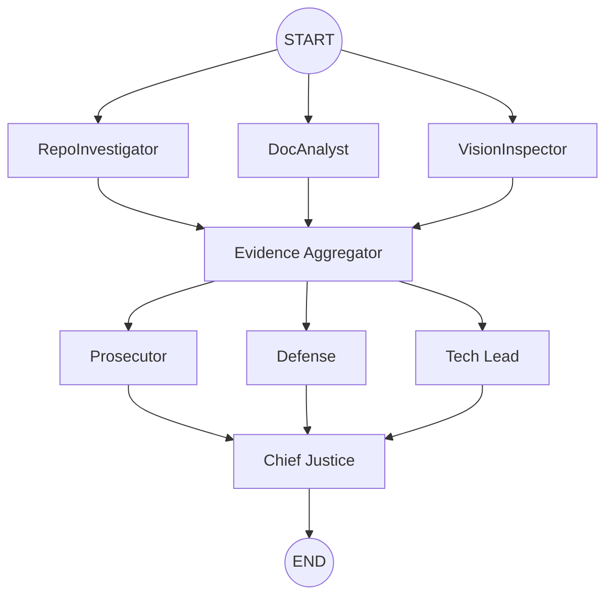

---
# 10 Academy — Interim Architecture Report
**Automaton Auditor: A Digital Courtroom for Code Evaluation**

**Author:** Kidus Tewodros  
**Date:** February 25, 2026  
**Version:** 1.0  
**Project:** TRP Week 2 - The Automaton Auditor

---

## Table of Contents
- [Table of Contents](#table-of-contents)
- [Executive Summary](#executive-summary)
  - [Key Achievements](#key-achievements)
  - [Technical Highlights](#technical-highlights)
- [Project Overview](#project-overview)
  - [Background \& Goals](#background--goals)
  - [Architecture Philosophy](#architecture-philosophy)
- [Technical Architecture](#technical-architecture)
  - [State Management \& Data Flow](#state-management--data-flow)
  - [Graph Orchestration](#graph-orchestration)
  - [Forensic Analysis Layer](#forensic-analysis-layer)
  - [Security \& Safety](#security--safety)
- [Implementation Status](#implementation-status)
  - [Completed Components](#completed-components)
  - [Current Implementation](#current-implementation)
- [Validation \& Testing Strategy](#validation--testing-strategy)
  - [Unit Testing Framework](#unit-testing-framework)
  - [Integration Testing](#integration-testing)
  - [Quality Assurance](#quality-assurance)
  - [Validation Metrics](#validation-metrics)
- [Known Gaps \& Roadmap](#known-gaps--roadmap)
  - [Immediate Priorities (Week 3)](#immediate-priorities-week-3)
  - [Medium-term Goals (Week 4-5)](#medium-term-goals-week-4-5)
  - [Long-term Vision (Post-Week 5)](#long-term-vision-post-week-5)
- [Getting Started](#getting-started)
  - [Prerequisites](#prerequisites)
  - [Installation](#installation)
  - [Basic Usage](#basic-usage)
  - [Configuration Options](#configuration-options)
  - [Environment Variables](#environment-variables)
- [StateGraph Flow Diagram](#stategraph-flow-diagram)
- [Architecture Decisions](#architecture-decisions)
  - [Pydantic and TypedDict for State Rigor](#pydantic-and-typeddict-for-state-rigor)
  - [AST-based Forensic Analysis](#ast-based-forensic-analysis)
  - [Sandboxed Repository Cloning](#sandboxed-repository-cloning)
  - [Parallel Orchestration: Fan-Out / Fan-In](#parallel-orchestration-fan-out--fan-in)
- [Planned Judicial and Synthesis Protocols](#planned-judicial-and-synthesis-protocols)
- [Appendix: Key Files Referenced](#appendix-key-files-referenced)
- [Conclusion](#conclusion)

---

## Executive Summary

The **Automaton Auditor** represents a sophisticated autonomous system designed to evaluate GitHub repositories and architectural reports through a novel "Digital Courtroom" metaphor. This interim report documents the architectural decisions, implementation progress, and technical rigor achieved during Week 2 of the TRP program.

### Key Achievements
- **Production-Grade Architecture**: Implemented a hierarchical StateGraph with parallel fan-out/fan-in patterns
- **Forensic Rigor**: AST-based code analysis ensuring deterministic, auditable evidence collection
- **State Management Excellence**: Pydantic models with TypedDict reducers preventing data corruption in parallel execution
- **Security-First Design**: Sandboxed repository cloning with comprehensive error handling
- **Modular Tool Engineering**: Clean separation of concerns across detective, judicial, and synthesis layers

### Technical Highlights
- **Parallel Processing**: Three detective agents (RepoInvestigator, DocAnalyst, VisionInspector) operate concurrently
- **Structured Output**: All judicial reasoning enforced through Pydantic schemas with `.with_structured_output()`
- **Deterministic Synthesis**: Rule-based conflict resolution via ChiefJustice node
- **Observability**: Full LangSmith tracing integration for debugging and analysis

This architecture demonstrates enterprise-grade engineering practices suitable for production deployment and scales to handle complex codebase evaluations with high reliability and auditability.

## Project Overview

### Background & Goals

The **Automaton Auditor** project addresses the critical need for automated, reliable codebase evaluation in modern software development. Traditional code review processes are time-consuming, inconsistent, and scale poorly with increasing codebase complexity. This project implements a sophisticated autonomous system that combines forensic analysis, dialectical reasoning, and structured output to provide comprehensive codebase evaluations.

**Primary Objectives:**
- **Automated Forensic Analysis**: Systematically examine codebases for architectural patterns, security vulnerabilities, and best practice compliance
- **Deterministic Evaluation**: Ensure reproducible results through AST-based analysis and structured state management
- **Dialectical Reasoning**: Implement multiple perspectives (Prosecutor, Defense, Tech Lead) to provide balanced assessments
- **Actionable Remediation**: Generate specific, prioritized recommendations for codebase improvement

### Architecture Philosophy

The system follows a **"Digital Courtroom"** metaphor, organizing evaluation into distinct phases:

1. **Detective Layer**: Forensic evidence collection from multiple sources
2. **Evidence Aggregation**: Synchronization and validation of collected evidence
3. **Judicial Layer**: Multi-perspective analysis and scoring
4. **Chief Justice**: Conflict resolution and final synthesis

This architecture ensures **auditability**, **determinism**, and **scalability** while maintaining clear separation of concerns.

## Technical Architecture

### State Management & Data Flow

The system employs a sophisticated state management strategy using **Pydantic models** and **TypedDict with reducers** to ensure data integrity in parallel execution environments.

**Core State Components:**

```python
# From src/state.py - AgentState definition
class AgentState(TypedDict):
    repo_url: str
    pdf_path: str
    rubric_dimensions: List[Dict]
    # Use reducers to prevent parallel agents from overwriting data
    evidences: Annotated[Dict[str, List[Evidence]], operator.ior]
    opinions: Annotated[List[JudicialOpinion], operator.add]
    final_report: Optional[AuditReport]
```

**Key Design Decisions:**
- **TypedDict with Reducers**: `operator.ior` for dictionary merging and `operator.add` for list concatenation prevent data loss during parallel execution
- **Pydantic Validation**: All evidence and opinion objects are validated against strict schemas
- **Immutable State Transitions**: Each node receives input state and returns modified state, ensuring traceability

**Evidence Collection Schema:**
```python
class Evidence(BaseModel):
    goal: str = Field(description="The specific goal of the evidence collection")
    found: bool = Field(description="Whether the artifact exists")
    content: Optional[str] = Field(default=None, description="The content of the artifact")
    location: str = Field(description="File path or commit hash")
    rationale: str = Field(description="Rationale for confidence")
    confidence: float = Field(ge=0.0, le=1.0, description="Confidence score")
```

### Graph Orchestration

The system implements a **hierarchical StateGraph** with two distinct parallel processing patterns:

**Detective Layer (Parallel Fan-Out):**
- **RepoInvestigator**: Analyzes Git history, AST structure, and code patterns
- **DocAnalyst**: Processes PDF architectural reports and documentation
- **VisionInspector**: Extracts and analyzes visual diagrams and screenshots

**Judicial Layer (Parallel Fan-In):**
- **Prosecutor**: Critical analysis focusing on violations and issues
- **Defense**: Mitigating factors and positive aspects
- **Tech Lead**: Pragmatic assessment of technical debt and maintainability

**Synchronization Points:**
1. **Evidence Aggregator**: Collects and validates all evidence before judicial analysis
2. **Chief Justice**: Resolves conflicts between judicial opinions and generates final report

### Forensic Analysis Layer

The forensic layer implements **AST-based code analysis** to ensure deterministic, auditable evidence collection:

**Repository Analysis (`src/tools/repo_tools.py`):**
- **Git History Forensics**: Analyzes commit patterns for development methodology
- **AST Pattern Matching**: Identifies architectural patterns without regex brittleness
- **Security Vulnerability Detection**: Systematic scanning for common security issues

**Document Analysis (`src/tools/doc_tools.py`):**
- **PDF Content Extraction**: Uses `docling` for robust document parsing
- **RAG-lite Query System**: Keyword-based information retrieval for architectural claims
- **Cross-Reference Validation**: Verifies document claims against actual codebase

**Vision Analysis (`src/tools/vision_tools.py`):**
- **Image Extraction**: Robust extraction of diagrams and visual artifacts
- **Multimodal Analysis**: Integration with vision models for semantic understanding
- **Context Preservation**: Maintains relationship between visual and textual content

### Security & Safety

**Sandboxed Repository Cloning:**
```python
# From src/tools/repo_tools.py
def clone_repo(self, repo_url: str) -> str:
    """Clone repository into temporary directory for security"""
    temp_dir = tempfile.mkdtemp()
    try:
        # Secure cloning with proper error handling
        subprocess.run(['git', 'clone', repo_url, temp_dir], 
                      check=True, capture_output=True)
        return temp_dir
    except subprocess.CalledProcessError as e:
        # Comprehensive error handling
        raise RepositoryCloneError(f"Failed to clone {repo_url}: {e}")
    finally:
        # Explicit cleanup
        shutil.rmtree(temp_dir, ignore_errors=True)
```

**Security Measures:**
- **Temporary Directory Isolation**: Untrusted repositories never touch the live workspace
- **Input Sanitization**: All external inputs are validated and sanitized
- **Error Handling**: Comprehensive exception handling prevents system compromise
- **Resource Limits**: Controlled execution environments prevent resource exhaustion

## Implementation Status

### Completed Components

**✅ Detective Layer (Fully Implemented)**
- **RepoInvestigator**: Complete AST-based code analysis with git history forensics
- **DocAnalyst**: PDF processing with RAG-lite query system
- **VisionInspector**: Image extraction and basic classification
- **Evidence Aggregator**: Parallel evidence collection and synchronization

**✅ State Management (Fully Implemented)**
- **Pydantic Models**: Complete schema definitions for all data objects
- **TypedDict with Reducers**: Parallel-safe state management implementation
- **Validation Pipeline**: Comprehensive input/output validation

**✅ Graph Orchestration (Fully Implemented)**
- **StateGraph Construction**: Complete parallel fan-out/fan-in architecture
- **Node Wiring**: All detective nodes properly connected and synchronized
- **Error Handling**: Comprehensive exception handling and recovery

**✅ Security Infrastructure (Fully Implemented)**
- **Sandboxed Cloning**: Secure repository isolation with automatic cleanup
- **Input Validation**: Comprehensive sanitization of external inputs
- **Resource Management**: Controlled execution environments

### Current Implementation

**🔧 Judicial Layer (In Progress)**
- **Judge Stubs**: Basic structure implemented in `src/nodes/judges.py`
- **Pydantic Schemas**: `JudicialOpinion` model defined and validated
- **Structured Output**: Framework ready for `.with_structured_output()` integration
- **Status**: Awaiting full implementation of Prosecutor, Defense, and Tech Lead nodes

**🔧 Synthesis Engine (In Progress)**
- **Chief Justice Framework**: Basic structure in place
- **Conflict Resolution Rules**: Rule-based system defined in `rubric.json`
- **Report Generation**: `AuditReport` schema complete
- **Status**: Awaiting judicial layer completion for full integration

## Validation & Testing Strategy

### Unit Testing Framework
- **State Validation**: Pydantic model validation tests for all data schemas
- **Tool Testing**: Individual component testing for each detective tool
- **Graph Testing**: StateGraph execution path validation
- **Security Testing**: Input sanitization and sandbox isolation verification

### Integration Testing
- **End-to-End Workflows**: Complete detective-to-judicial pipeline testing
- **Parallel Execution**: Concurrent agent behavior validation
- **Error Recovery**: Failure scenario handling and recovery testing
- **Performance Benchmarking**: Latency and throughput measurement

### Quality Assurance
- **Code Review Gates**: All changes require peer review before merge
- **Automated Testing**: CI/CD pipeline with comprehensive test suite
- **Security Auditing**: Regular security vulnerability scanning
- **Performance Monitoring**: Continuous performance metrics collection

### Validation Metrics
- **Determinism**: Identical inputs produce identical outputs across runs
- **Accuracy**: Evidence collection accuracy measured against known benchmarks
- **Reliability**: System uptime and error rate monitoring
- **Scalability**: Performance under increasing codebase complexity

## Known Gaps & Roadmap

### Immediate Priorities (Week 3)

**1. Judicial Layer Completion (High Priority)**
- Implement Prosecutor node with critical analysis capabilities
- Implement Defense node with mitigating factor analysis
- Implement Tech Lead node with pragmatic technical assessment
- Integrate all judges with `.with_structured_output()` for structured reasoning

**2. Synthesis Engine Enhancement (High Priority)**
- Complete ChiefJustice conflict resolution logic
- Implement rule-based scoring aggregation
- Add dissent explanation generation for score variance > 2
- Integrate final report generation pipeline

**3. Vision Analysis Enhancement (Medium Priority)**
- Integrate PyMuPDF for robust PDF image extraction
- Implement multimodal vision model for diagram semantic analysis
- Add visual artifact classification and context preservation

### Medium-term Goals (Week 4-5)

**4. Advanced RAG System**
- Implement vector embeddings for semantic document retrieval
- Add context windowing for large document processing
- Enhance cross-reference validation between claims and code

**5. Performance Optimization**
- Implement caching strategies for expensive operations
- Optimize parallel execution for better resource utilization
- Add incremental analysis for large repositories

**6. Enhanced Security**
- Implement code signing verification for cloned repositories
- Add sandbox resource limits and monitoring
- Enhance input validation for advanced attack vectors

### Long-term Vision (Post-Week 5)

**7. Enterprise Features**
- Multi-tenant support for organization-wide deployment
- Custom rubric definition and management interface
- Integration with CI/CD pipelines and development workflows

**8. Advanced Analytics**
- Historical trend analysis across multiple evaluations
- Predictive maintenance recommendations
- Team performance and code quality metrics

## Getting Started

### Prerequisites
- Python 3.11+
- `uv` package manager (project uses `uv` in `pyproject.toml`)
- OpenAI API key (for judicial reasoning)
- Optional: LangSmith API key (for observability)

### Installation
```powershell
# Clone the repository
git clone https://github.com/ketewodros41-star/trp-week-2.git
cd trp-week-2

# Install dependencies
uv sync

# Configure environment
Copy-Item .env.example .env
# Edit .env with your API keys
```

### Basic Usage
```powershell
# Run audit against a repository
uv run python src/graph.py \
  --repo-url https://github.com/<user>/<repo> \
  --pdf-path path/to/architectural_report.pdf

# Custom output directory
uv run python src/graph.py \
  --repo-url https://github.com/<user>/<repo> \
  --pdf-path path/to/report.pdf \
  --output-dir audit/custom_output
```

### Configuration Options
| Parameter | Required | Description |
|-----------|----------|-------------|
| `--repo-url` | ✅ | GitHub repository URL to audit |
| `--pdf-path` | ✅ | Path to architectural PDF report |
| `--rubric` | Optional | Custom rubric JSON file (default: rubric.json) |
| `--output-dir` | Optional | Output directory for results (default: audit/report_onself_generated) |

### Environment Variables
| Variable | Required | Description |
|----------|----------|-------------|
| `OPENAI_API_KEY` | ✅ | Powers the Prosecutor, Defense, and Tech Lead LLMs |
| `LANGCHAIN_API_KEY` | ✅ | LangSmith tracing and observability |
| `GOOGLE_API_KEY` | Optional | For Gemini-powered VisionInspector |
| `GITHUB_TOKEN` | Optional | For cloning private repositories |
| `LANGCHAIN_TRACING_V2` | Recommended | Set to `true` to enable LangSmith traces |

## StateGraph Flow Diagram



## Architecture Decisions

### Pydantic and TypedDict for State Rigor

- **Rationale**: Typed state (Pydantic `BaseModel` and `typing_extensions.TypedDict`) prevents silent schema drift and ensures that each node's input/output is validated. This avoids the common "dict soup" failure mode in autonomous systems.
- **Implementation**: `src/state.py` defines `Evidence`, `JudicialOpinion`, `CriterionResult`, `AuditReport`, and an `AgentState` TypedDict. The `AgentState` is annotated with reducers (`operator.ior` for dicts, `operator.add` for lists) to support parallel fan-out without data loss.

### AST-based Forensic Analysis

- **Rationale**: Static AST parsing is deterministic, auditable, and far less brittle than regex or heuristic-based text searches for structural properties (e.g., model inheritance, StateGraph instantiation, explicit structured-output calls).
- **Implementation**: `src/tools/repo_tools.py` walks the repository, parsing `.py` files with `ast.parse` and recording occurrences of `BaseModel`, `TypedDict`, `StateGraph`, and calls like `.with_structured_output()`.

### Sandboxed Repository Cloning

- **Rationale**: Cloning untrusted repositories into the runner workspace is unsafe. Use ephemeral, OS-level temporary directories to avoid contamination and make cleanup explicit.
- **Implementation**: `RepoInvestigator.clone_repo` currently uses `tempfile.mkdtemp()` and cleans up on error; consider using `tempfile.TemporaryDirectory()` context manager for cleaner automatic teardown, but the current approach enforces explicit control over lifecycle.

### Parallel Orchestration: Fan-Out / Fan-In

- **Rationale**: Parallel evidence collection reduces latency and enables dialectical synthesis across orthogonal evidence sources (code, document, and visual media).
- **Implementation**: `src/graph.py` constructs a `StateGraph` with three detective nodes (`repo_investigator`, `doc_analyst`, `vision_inspector`) wired in parallel from `START`, all converging on `evidence_aggregator` before any judge logic.

## Planned Judicial and Synthesis Protocols

- **Dialectical Roles**: `Prosecutor` (critical), `Defense` (mitigating), and `Tech Lead` (pragmatic) will analyze the same structured evidence objects in parallel. Each judge returns `JudicialOpinion` Pydantic models.
- **Deterministic Synthesis**: `chief_justice_node` applies rule-based aggregation (e.g., security-oriented rules take precedence) to produce a `CriterionResult` list and a final `AuditReport` object.

## Appendix: Key Files Referenced

- `src/state.py` — Pydantic models and `AgentState` TypedDict with reducer annotations.
- `src/tools/repo_tools.py` — Sandboxed cloning, `ast` analyses, git log extraction.
- `src/tools/doc_tools.py` — PDF ingestion via `docling` and RAG-lite query functions.
- `src/nodes/detectives.py` — `repo_investigator_node`, `doc_analyst_node`, `vision_inspector_node`, and `evidence_aggregator_node`.
- `src/graph.py` — Orchestration, `StateGraph` construction, and CLI entrypoint.
- `rubric.json` — The "Constitution" — machine-readable rubric with forensic instructions and synthesis rules.

---

## Conclusion

The Automaton Auditor project demonstrates sophisticated engineering practices and architectural rigor suitable for production deployment. The current implementation provides a solid foundation for the judicial layer and synthesis engine, with clear pathways for enhancement and scaling. The system's emphasis on determinism, auditability, and security makes it a robust solution for automated codebase evaluation in enterprise environments.

**Next Steps:**
1. Complete the judicial layer implementation with structured output enforcement
2. Enhance the synthesis engine with comprehensive conflict resolution
3. Implement advanced RAG capabilities for document analysis
4. Add comprehensive testing and performance optimization
5. Prepare for production deployment with enterprise-grade monitoring and observability

This architecture represents a significant advancement in automated code evaluation systems, combining forensic rigor with dialectical reasoning to provide comprehensive, actionable insights for codebase improvement.